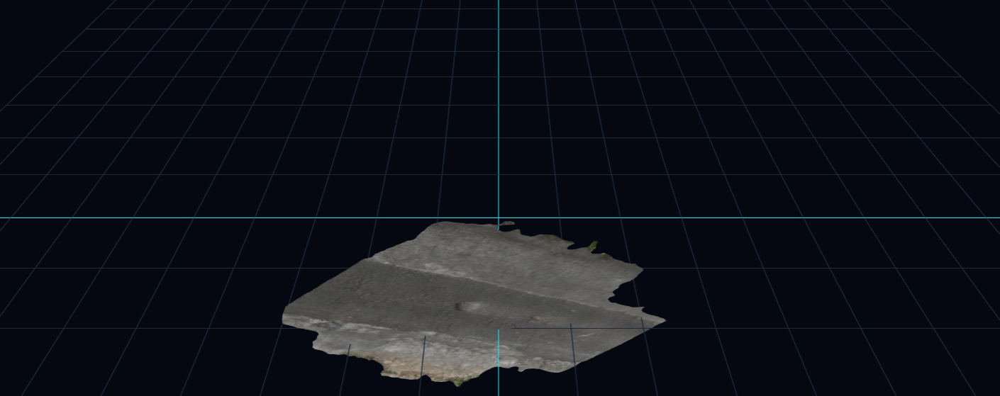

# Pothole3D Vision

Aplikasi web untuk **mendeteksi lubang jalan dan mengestimasi dimensi & volumenya** dari data foto udara UAV (fotogrametri).

Input berupa **Orthomosaic** dan **DSM** (GeoTIFF) hasil pengolahan fotogrametri (mis. Pix4Dmapper). Lubang disegmentasi dengan **YOLOv8-seg**, lalu kedalamannya dihitung dari DSM dengan menyesuaikan bidang permukaan jalan memakai **RANSAC**. Hasilnya berupa luas, kedalaman, dan volume tiap lubang, visualisasi 2D, tampilan mesh 3D, serta ekspor CSV/XLSX.



---

## Alur Pemrosesan

1. **Validasi & penyelarasan**: Orthomosaic dan DSM dicek lalu diselaraskan (reproject/resample) agar grid pikselnya sama.
2. **Deteksi**: YOLOv8-seg menghasilkan mask poligon tiap lubang pada orthomosaic.
3. **Estimasi kedalaman**: Di sekitar mask (buffer piksel), bidang jalan di-*fit* dengan RANSAC. Selisih bidang dengan DSM menjadi kedalaman.
4. **Metrik**: luas, kedalaman maksimum/rata-rata, dan volume tiap lubang, plus titik validasi (terdalam + 4 titik tepi).
5. **Output**: gambar visualisasi, mesh 3D (opsional, jika mesh OBJ diunggah), dan file CSV/XLSX.

## Teknologi

| Bagian | Stack |
|---|---|
| Backend | Python 3.12, FastAPI, Uvicorn, Ultralytics YOLOv8, PyTorch, Rasterio, OpenCV, scikit-learn, Pandas |
| Frontend | React 19, Vite 8, Three.js, Axios, lucide-react |

## Struktur Folder

```
website-6/
├── run_servers.py            # Menjalankan backend + frontend sekaligus
├── backend/
│   ├── requirements.txt      # Daftar library Python
│   ├── app/
│   │   ├── main.py           # Entry point FastAPI
│   │   ├── config.py         # Path & parameter default (conf, buffer, dll.)
│   │   ├── schemas.py
│   │   ├── routers/jobs.py   # Endpoint /api/jobs
│   │   └── services/         # validation, inference, depth, visualize, mesh, sample
│   ├── models_weights/       # Bobot model YOLOv8-seg (.pt), ikut di repo
│   └── storage/              # uploads/, results/, samples/ (isi tidak di-commit)
└── frontend/
    ├── package.json          # Daftar library JavaScript
    └── src/                  # pages/, components/, services/api.js
```

---

## Prasyarat

- **Python 3.12** (versi yang dipakai saat pengembangan)
- **Node.js 20.19+** (wajib untuk Vite 8) dan npm
- **Git**
- (Opsional) GPU NVIDIA + CUDA untuk inferensi yang lebih cepat. Tanpa GPU tetap jalan di CPU.

## Tentang `.gitignore`: yang TIDAK ikut ter-clone

Beberapa folder sengaja tidak di-push ke GitHub. Setelah clone, folder-folder ini harus dibuat ulang lewat instalasi:

| Diabaikan | Lokasi `.gitignore` | Cara mendapatkannya kembali |
|---|---|---|
| `venv/`, `.venv/`, `env/` (virtual env Python) | root & `backend/` | Buat venv baru, lalu `pip install -r backend/requirements.txt` |
| `node_modules/` (library frontend) | `frontend/` | `npm install` di folder `frontend` |
| `dist/` (hasil build frontend) | `frontend/` | `npm run build` jika diperlukan |
| `__pycache__/`, `*.pyc` | root & `backend/` | Dibuat otomatis oleh Python |
| `backend/storage/uploads/*`, `results/*`, `samples/*` | `backend/` | Terisi otomatis saat aplikasi dipakai (folder tetap ada lewat `.gitkeep`) |
| `.env`, `*.env` | root | Saat ini proyek tidak memerlukan file `.env` |
| `*.pt` di luar `backend/models_weights/` | root | Tidak diperlukan |
| `scratch_*.tif` | root & `backend/` | File percobaan, tidak diperlukan |

> **Model weights ikut di repo.** File `best.pt`, `bestNEW.pt`, dan `ModelTerbaik.pt` di `backend/models_weights/` dikecualikan dari aturan `*.pt`, jadi tidak perlu diunduh terpisah. Model default adalah `best.pt`. Model lain bisa dipilih dari antarmuka web.

Singkatnya, library **tidak** ada di repo. Yang ada hanya **daftarnya**:
- Python → [backend/requirements.txt](backend/requirements.txt)
- JavaScript → [frontend/package.json](frontend/package.json) + `package-lock.json`

---

## Instalasi

### 1. Clone repository

```bash
git clone https://github.com/NovalRizkyy24/Fotogrametri-UAV-Pothole-Detection.git
cd Fotogrametri-UAV-Pothole-Detection
```

### 2. Backend (Python)

Jalankan dari **root project** (bukan dari dalam folder `backend`):

```bash
# Buat virtual environment
python -m venv venv

# Aktifkan venv
# Windows (PowerShell):
venv\Scripts\Activate.ps1
# Windows (CMD):
venv\Scripts\activate.bat
# Linux / macOS:
source venv/bin/activate

# Instal library
pip install --upgrade pip
pip install -r backend/requirements.txt
```

> **Pakai GPU?** Instal PyTorch versi CUDA lebih dulu sesuai petunjuk di <https://pytorch.org/get-started/locally/>, misalnya:
> `pip install torch torchvision --index-url https://download.pytorch.org/whl/cu121`
> Setelah itu baru jalankan `pip install -r backend/requirements.txt`.

> Jika PowerShell menolak menjalankan `Activate.ps1`, jalankan dulu:
> `Set-ExecutionPolicy -Scope CurrentUser RemoteSigned`

### 3. Frontend (Node.js)

```bash
cd frontend
npm install
cd ..
```

---

## Menjalankan Aplikasi

### Cara cepat: satu perintah

Dari root project dengan venv aktif:

```bash
python run_servers.py
```

Script ini menjalankan backend dan frontend bersamaan. Tekan `Ctrl + C` untuk menghentikan keduanya.

### Cara manual: dua terminal

**Terminal 1: Backend** (dari root project, venv aktif)

```bash
python -m uvicorn backend.app.main:app --host 0.0.0.0 --port 8000 --reload
```

> Perintah ini harus dijalankan dari **root project** karena kode memakai import `backend.app...`. Jika dijalankan dari dalam folder `backend`, akan muncul error `ModuleNotFoundError: No module named 'backend'`.

**Terminal 2: Frontend**

```bash
cd frontend
npm run dev
```

### Alamat

| Layanan | URL |
|---|---|
| Aplikasi web | http://localhost:5173 |
| Backend API | http://localhost:8000 |
| Dokumentasi API (Swagger) | http://localhost:8000/docs |

Frontend memanggil backend di `http://localhost:8000` (lihat [frontend/src/services/api.js](frontend/src/services/api.js)). Jika port backend diubah, sesuaikan juga nilai `API_BASE_URL` di file tersebut.

---

## Cara Pakai

1. Buka http://localhost:5173.
2. Di halaman **Upload**, unggah:
   - **Orthomosaic** (GeoTIFF) – wajib
   - **DSM** (GeoTIFF) – wajib
   - Mesh 3D `.obj` + `.mtl` + tekstur – opsional, untuk tampilan 3D
   - Model `.pt` sendiri – opsional; jika kosong, dipakai model dari server
3. Atur *confidence threshold* (default `0.60`) dan *buffer* piksel (default `15`) jika perlu.
4. Pantau proses di halaman **Progress**, lalu lihat hasil di halaman **Result**: tabel lubang, visualisasi, dan viewer 3D.
5. Ekspor hasil ke **CSV** atau **XLSX**. Riwayat pemrosesan tersimpan di halaman **History**.

Belum punya data? Panggil endpoint `POST /api/jobs/sample` lewat http://localhost:8000/docs. Endpoint ini membuat GeoTIFF & mesh sintetis untuk mencoba alur pemrosesan. Hasilnya bisa dilihat di halaman **History**.

## Endpoint API Utama

| Method | Endpoint | Fungsi |
|---|---|---|
| `GET` | `/api/jobs/models` | Daftar model yang tersedia di server |
| `POST` | `/api/jobs` | Membuat job baru (upload file) |
| `POST` | `/api/jobs/sample` | Membuat job dengan dataset sampel |
| `GET` | `/api/jobs` | Riwayat semua job |
| `GET` | `/api/jobs/{job_id}` | Status & progres job |
| `GET` | `/api/jobs/{job_id}/result` | Hasil lengkap job |
| `GET` | `/api/jobs/{job_id}/export/{csv\|xlsx}` | Unduh hasil |
| `PATCH` | `/api/jobs/{job_id}/rename` | Ganti nama job |
| `DELETE` | `/api/jobs/{job_id}` | Hapus job |

## Konfigurasi

Parameter default ada di [backend/app/config.py](backend/app/config.py):

| Parameter | Default | Keterangan |
|---|---|---|
| `DEFAULT_MODEL_PATH` | `models_weights/best.pt` | Model YOLOv8-seg default |
| `DEFAULT_CONF_THRESHOLD` | `0.60` | Ambang confidence deteksi |
| `DEFAULT_BUFFER_PX` | `15` | Lebar area di sekitar lubang (piksel) untuk fitting bidang jalan |
| `DEFAULT_OFFSET_RATIO` | `0.6` | Posisi 4 titik validasi tepi relatif terhadap titik terdalam |

## Troubleshooting

| Masalah | Solusi |
|---|---|
| `ModuleNotFoundError: No module named 'backend'` | Jalankan uvicorn dari **root project**, bukan dari folder `backend`. |
| `ModuleNotFoundError` untuk library lain (fastapi, rasterio, ...) | Pastikan venv aktif, lalu jalankan `pip install -r backend/requirements.txt`. |
| `'vite' is not recognized` / `vite: not found` | Jalankan `npm install` di folder `frontend`. |
| Vite error soal versi Node | Upgrade Node.js ke 20.19 atau lebih baru. |
| Frontend tampil tapi data tidak muncul / network error | Pastikan backend berjalan di port 8000. Cek http://localhost:8000/docs. |
| Instalasi `rasterio` gagal | Upgrade pip (`pip install --upgrade pip`) agar memakai wheel siap pakai. Gunakan Python 3.12. |
| Inferensi sangat lambat | Wajar di CPU. Instal PyTorch versi CUDA jika punya GPU NVIDIA. |
